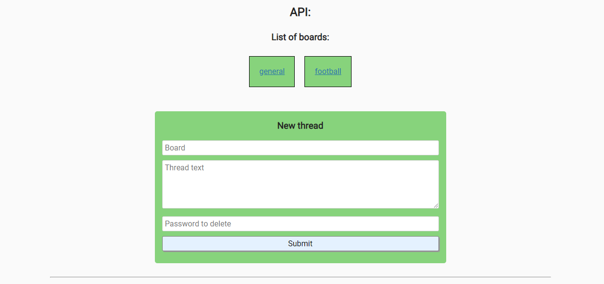
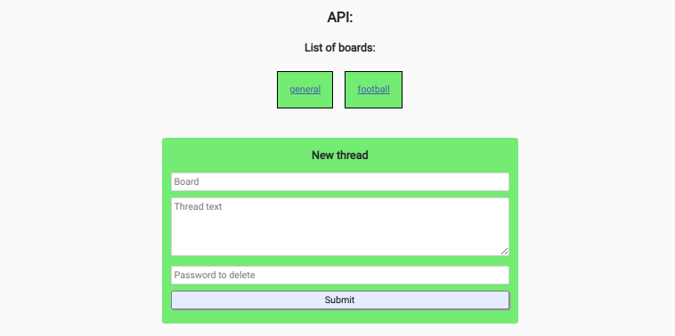

# Anonymous Message Board

## Introduction
Users are presented with a number of message boards. Each board shows a list of threads containing the original message and the replies to it.  

Additional message boards are added if they dont exist. Threads and replies can be deleted with the original owners password.  

Testing is down with Chai.

This project is part of freeCodeCamps Information Security and Quality Assurance certificate.

***
## Project Requirements
* Only allow the site to be loading in an iFrame on your own pages.
* Do not allow DNS prefetching.
* Only allow the site to send the referrer for its own pages.
* It is possible to POST a thread to a specific message board by passing form data text and delete_password to /api/threads/{board}. (Recomend res.redirect to board page /b/{board}) Saved will be \_id, text, created_on (date & time), bumped_on (date & time, starts same as created_on), reported (boolean), delete_password & replies (array).
* It is possible to POST a reply to a thead on a specific board by passing form data text, delete_password & thread_id to /api/replies/{board} and it will also update the bumped_on date to the comments date. (Recomend res.redirect to thread page /b/{board}/{thread_id}) In the thread's 'replies' array will be saved \_id, text, created_on, delete_password & reported.
* It is possible to GET an array of the most recent 10 bumped threads on the board with only the most recent 3 replies from /api/threads/{board}. The reported and delete_passwords fields will not be sent.
* It is possible to GET an entire thread with all it's replies from /api/replies/{board}?thread_id={thread_id}. Also hiding the same fields.
* It is possible to delete a thread completely if I send a DELETE request to /api/threads/{board} and pass along thread_id & delete_password. (Text response will be "incorrect password" or "success")
* It is possible to delete a post (just changing the text to "\[deleted]") if I send a DELETE request to /api/replies/{board} and pass along thread_id, reply_id & delete_password. (Text response will be "incorrect password" or "success")
* It is possible to report a thread and change its reported value to true by sending a PUT request to /api/threads/{board} and pass along thread_id. (Text response will be "success")
* It is possible to report a reply and change it's reported value to true by sending a PUT request to /api/replies/{board} and pass along thread_id & reply_id. (Text response will be "success)
* Complete all functional tests.

***

## Final Project
https://fcc-infosec-anonymous-message-board-fred.glitch.me

***

## Technologies
### Frontend
* HTML5
* CSS3
* JavaScript

### Backend
* Node
* Express
* Helmet
* Chai
* Mongodb

## Database:
* MongoDB

## Hosting:
* Glitch
* mLab

***

## Preview Images
### Boards View:

### Thread and Replies View:
  
