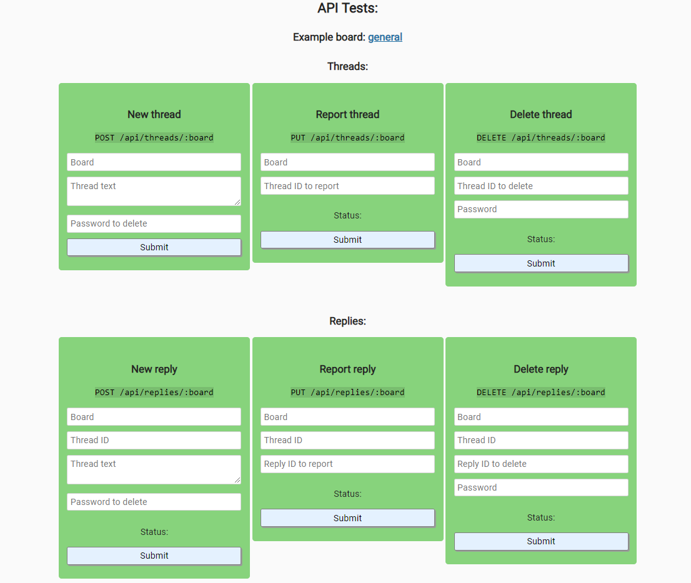

# Anonymous Message Board

## Introduction
Users are presented with a number of message boards, each board shows a list of threads containing the original message and the replies to it.  

Additional message boards are added if they dont exist. Threads and replies can be deleted with the original password.  

Main focus lies on the implementation of the backend and its feature testing.  

This project is part of freeCodeCamps Information Security and Quality Assurance certificate.

***
## Project Requirements
  

***

## Final Project
https://fcc-infosec-anonymous-message-board-fred.glitch.me

***

## Technologies
### Frontend
* HTML5
* CSS3
* JavaScript

### Backend
* Node
* Express
* Helmet
* Chai
* MongoDB

***

## Preview Images
### Boards View:

### Thread and Replies View:
  
